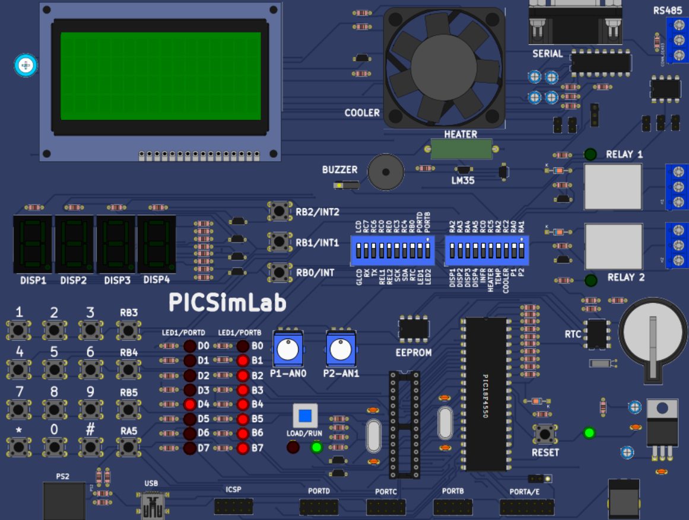
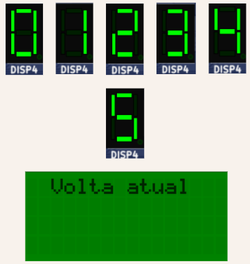
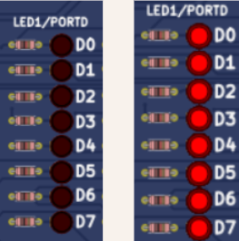
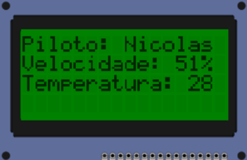
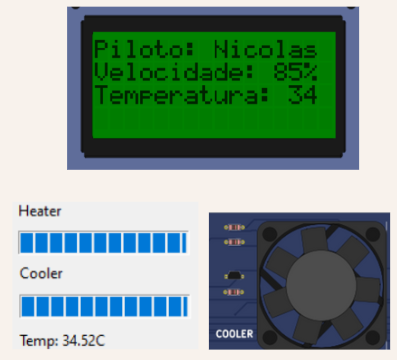

# Projeto de Simulação de Treinamento de Piloto de Fórmula 1

## Português

## Introdução

Este projeto foi desenvolvido em MikroC for PIC utilizando o PIC18F4550 e faz uma alusão ao treinamento de um piloto de Fórmula 1, realizado durante 5 voltas e monitorado pelo engenheiro de desempenho. O treinador do piloto é responsável por melhorar o desempenho, analisando dados como temperatura do motor e velocidade, além de fornecer orientações para otimizar a performance do piloto em pista.

  

## Funcionalidades

### Tela de Início

  

- Ao iniciar o programa, o LCD foi personalizado para exibir um carro e o logotipo da Fórmula 1.
- A tela de abertura é exibida por 5 segundos, tempo controlado utilizando o TIMER.

### Controle de Voltas

  

- Ao apertar o botão **RB1**, o display é acionado e vai de 0 a 5, indicando a volta atual no LCD.
- O painel de controle permanece aberto para que o treinador possa monitorar e analisar a performance do piloto.

### Largada

  

- Ao clicar no botão **RB0**, as luzes de largada são ativadas, sinalizando o início da corrida.

### Dados do Piloto

  

- Assim que as luzes de largada apagam, os dados do piloto são exibidos automaticamente para o engenheiro de desempenho.

#### Velocidade
- A velocidade do carro é apresentada em porcentagem, utilizando um potenciômetro, e é exibida no LCD para o engenheiro monitorar.

#### Temperatura do Motor
- A temperatura do motor é constantemente exibida para análise, sendo um dado essencial para a prevenção de acidentes.

### Controle de Temperatura

#### Velocidade Inferior a 70%
- Quando a velocidade do carro está abaixo de 70%, a temperatura do motor se mantém estável.

#### Velocidade Igual ou Acima de 70%

  

- Quando a velocidade atinge ou ultrapassa 70%, a temperatura do motor começa a subir.
- Ao atingir 35ºC, um cooler é ativado para manter a temperatura entre 34ºC e 35ºC.

#### Velocidade Máxima (100%)

- Quando a velocidade chega a 100%, a temperatura do motor ainda está em 35ºC, mas um cooler de emergência é ativado por precaução.
- O buzzer também é acionado para alertar o engenheiro de que o motor está operando em sua velocidade máxima.
